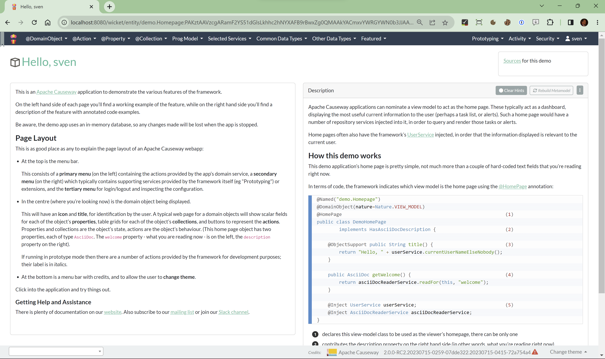

[](https://github.com/apache-causeway-committers/causeway-nightly-deploys/actions/workflows/build-referenceapp.yml)

You can explore the Apache Causeway™ programming model through the reference app, which illustrates many of the framework's annotations and programming conventions.



The app is available as a Docker image.

* to run the JPA variant:

  ```bash
  docker pull apache/causeway-app-referenceapp-jpa:latest
  docker run -p 8080:8080 apache/causeway-app-referenceapp-jpa:latest
  ```


* to run the JDO variant:

  ```bash
  docker pull apache/causeway-app-referenceapp-jdo:latest
  docker run -p 8080:8080 apache/causeway-app-referenceapp-jdo:latest
  ```

... then navigate to http://localhost:8080


## To build

Prereqs:

* mvnd 3.6.x
* Java 11

Building:

* To build the JPA variant:

  ```bash
  mvnd -Dwicket-jdo install
  ```
* 
* To build the JDO variant:

  ```bash
  mvnd -Dwicket-jdo install
  ```
